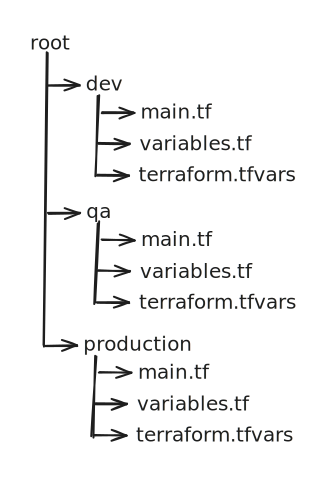

# Compressing Multiple Commits

The goal here is to compress multiple previous commits into one, so that you can keep a cleaner commit history. Essentially we will be taking the updates from 1354d91, 6f09339, and 89cc676 and put them into one final commit.

Review the contents of [Undoing Commits (reset)](undoing-commits-reset.md). You use either a mixed (default) or a soft reset to achieve your results. Do _**NOT**_ use a hard reset. I prefer to utilize a mixed reset, as it will force you to review you files one last time by adding them into the index individually.

We will be working with the assumption our commit history looks like the following.

1. Identify how far back you would like to reset to. In this case we want to reset to 2af74ca.
2. Run **git reset 2af74ca** (you can also use a soft one, just NOT a hard reset)
3. run **git status** to run very the files you need to review and add to the index.
4. For each file run **git add \<fileName>**
5. Finally we are ready to commit by running **git commit -m "One message to rule them all"**
