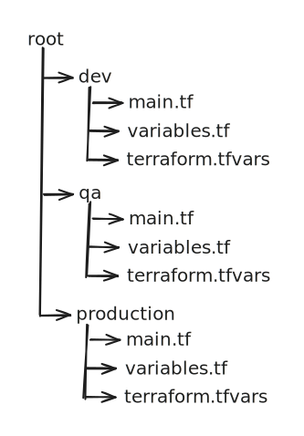

# Directory Structure Options

A few options for when it comes to defining directories when working with multiple environments.

## By Directory

### How to work with it

* cd \<env\_dir>
* terraform init
* terraform plan -out="out.tfplan"
* terraform apply out.tfplan

## By Environment Configuration

### How to work with it

* terraform init -backend\_config=\<env>-backend.tfvars
* terraform plan -out="out.tfplan" -var-file="\<env>.tfvars
* terraform apply out.tfplan

I[nformation for backend configuration.](https://developer.hashicorp.com/terraform/cli/commands/init#backend-initialization)
